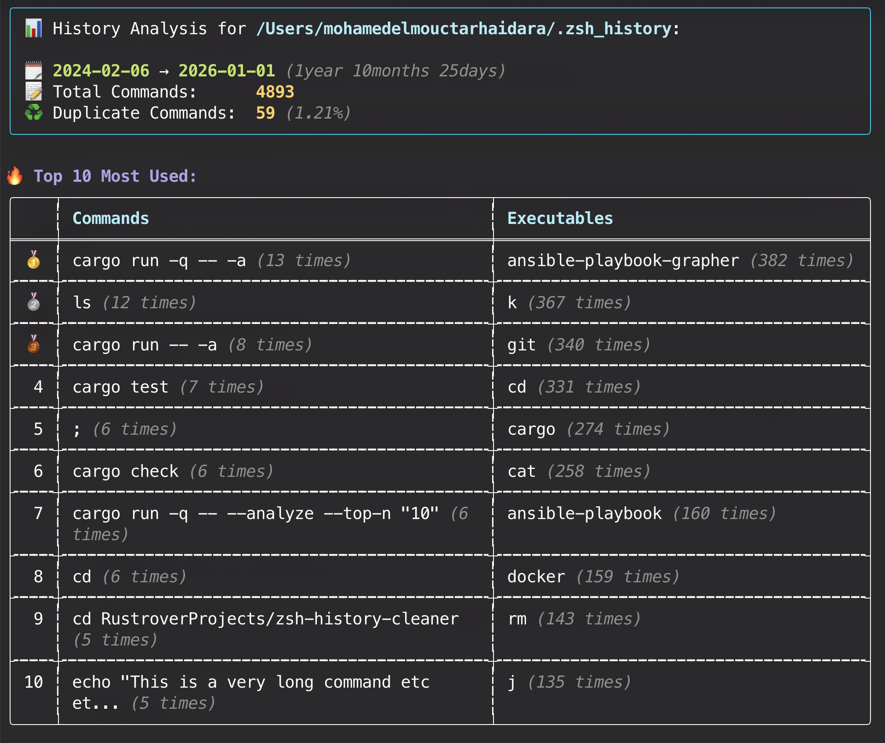

# Zsh History Cleaner

A command line tool to clean your .zsh history by:

- Removing duplicate commands: the first command is kept among the duplicates.
- Removing commands from specific time ranges.
- Providing an analysis of your history file:
  

> [!WARNING]  
> **Disclaimer:** I'm primarily using this project as an opportunity to learn the Rust programming language (it's my
> first project in Rust). As such, do not expect the project to be a full-featured solution for cleaning your history
> file. A backup of your history file is created by default before any modification. Use the
`--no-backup` flag with caution.

## Roadmap

Contributions are welcome! Some ideas for future improvements:

- Removing commands matching some patterns
- Detect commands including sensitive information like passwords, secrets, API Keys etc...
- Auto removing backup files older than a certain date
- Read the history file from the env var `HISTFILE`
- Cargo binstall and/or binaries assets in GitHub releases
- Support non UTF-8 history files/charsets (for emojis etc...)

## Limitations

- Only the `.zsh_history` file format is supported.
- The history file is expected to be in UTF-8 encoding and should not contain non UTF-8 characters.

## Installation

```shell
cargo install zsh-history-cleaner
zhc --help
```

## Examples:

- Analyze the history file and print some statistics:
    ```shell
    $ zhc --analyze # or zhc -a
    ```
- Remove duplicate commands from the default history file (`~/.zsh_history`):
    ```shell
    $ zhc
    ```
- Remove commands between two dates (inclusive) and keep duplicate commands:
    ```shell
    $ zhc --remove-between 2023-01-01 2023-06-30 --keep-duplicates
    ```

## Usage

```
Clean your commands history by removing duplicate commands, commands between dates, etc...

By default, all the duplicate commands are removed.

Usage: zhc [OPTIONS]

Options:
  -d, --dry-run
          Dry run mode. The history file is not modified when this flag is used

  -H, --history-file <HISTORY_FILE>
          The history file to use
          
          [default: ~/.zsh_history]

      --no-backup
          [USE WITH CAUTION!!] Disable the history file backup. By default, a backup is written to '{history_file_path}.zhc_backup_{timestamp}'

  -k, --keep-duplicates
          Should we keep duplicate commands in the history file?

  -r, --remove-between <START_DATE> <END_DATE>
          Remove commands between the provided two dates (included): YYYY-MM-DD YYYY-MM-DD. The first date must be before or equal to the second date. Example: --remove-between 2023-01-01 2023-06-30

  -a, --analyze
          Analyze the history file and provide statistics about the commands over time. No changes are made to the history file when this flag is used

      --top-n <TOP_N>
          Number of top commands/executables to display in analysis. Only used with --analyze
          
          [default: 10]

  -h, --help
          Print help (see a summary with '-h')

  -V, --version
          Print version

```

## Development and test

```shell
cargo build
cargo test
```

## Release

The code is set up to use `cargo-release` and `git-cliff` to automate releases and CHANGELOG generation. The workflow
automatically pushes to crates.io when a new tag is pushed with the
**[Trusted Publishing](https://crates.io/docs/trusted-publishing) feature enabled and enforced.** 
